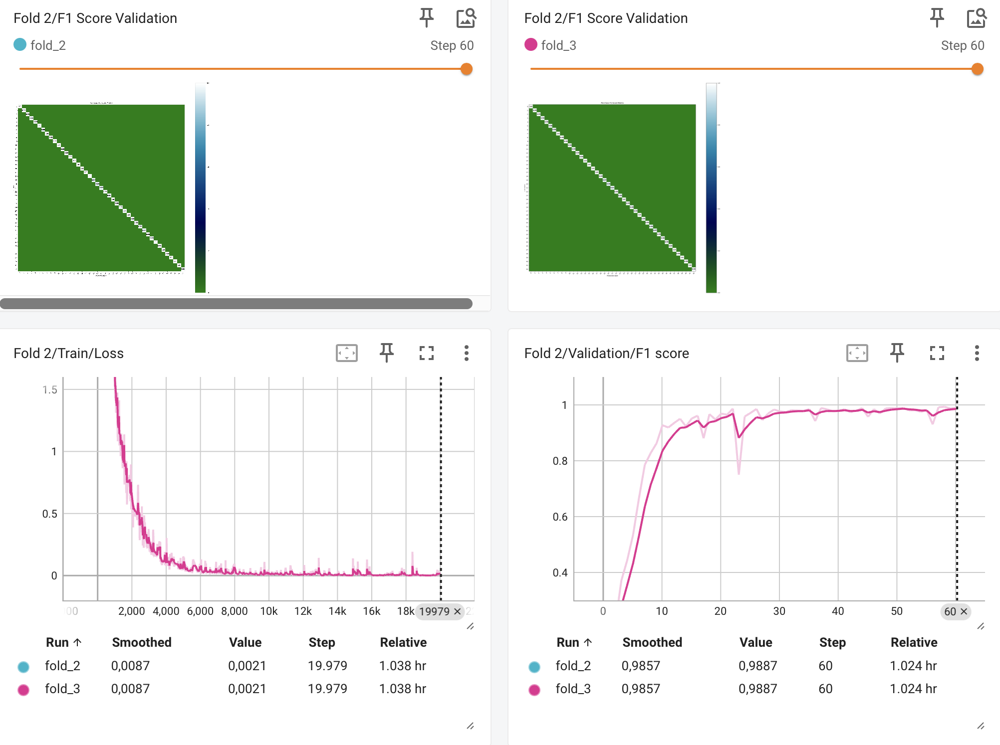

<p align="center">
    
</p>

<p align="center">
    
</p>


## Mamba For Vision: You Only Need 197k Parameters for Traffic Sign Classification


⭐If this work is helpful for you, please help star this repo. Thanks!🤗


<a name="Getting_Started">
</a>

## Getting Started

### Installation

**Step 1: Clone the VMamba repository:**

To get started, first clone the Traffic-Sign-Classification repository and navigate to the project directory:

```bash
git clone https://github.com/tuan-nv0505/Traffic-Sign-Classification.git
cd Traffic-Sign-Classification
```

**Step 2: Environment Setup:**

***Create and activate a new conda environment***

```bash
conda create -n vmamba
conda activate vmamba
```

***Install Dependencies***

```bash
pip install -r requirements.txt
```

**Step 3: Train:**


```bash
python train.py \
--epochs 70 \
--batch 64 \
--load_checkpoint \
--workers 4 \
--lr 1e-4 \
--path_data /your_path/GTSRB \
--trained /your_path/trained \
--logging /your_path/tensorboard \
--deep 4 \
--device cuda
```

### Acknowledgments
This project is based on the architecture of MambaTSR, a pioneering research by 1024AILab on State Space Models (SSMs) for traffic sign recognition.

I have implemented key modifications to optimize the model specifically for the Traffic Sign Classification task:

Parameter Optimization: Compressed the model into an ultra-lightweight version with only 197k parameters.

Flexibility & Accessibility: Removed the strict dependency on CUDA, enabling the model to run efficiently across various hardware platforms (including CPU-only environments) while maintaining impressive accuracy.